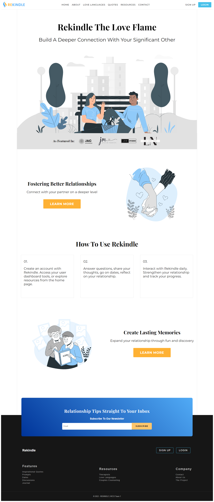
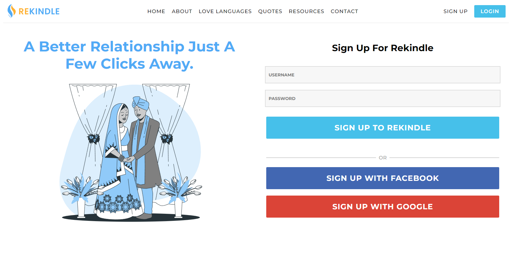
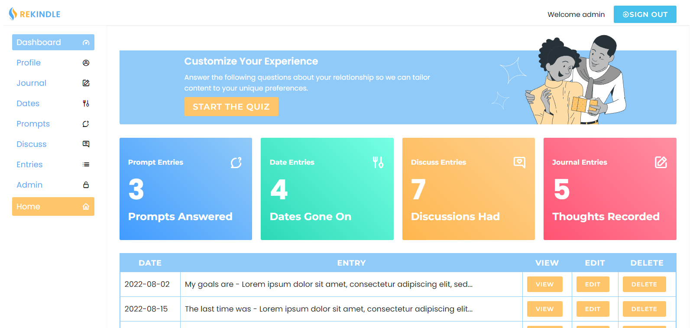
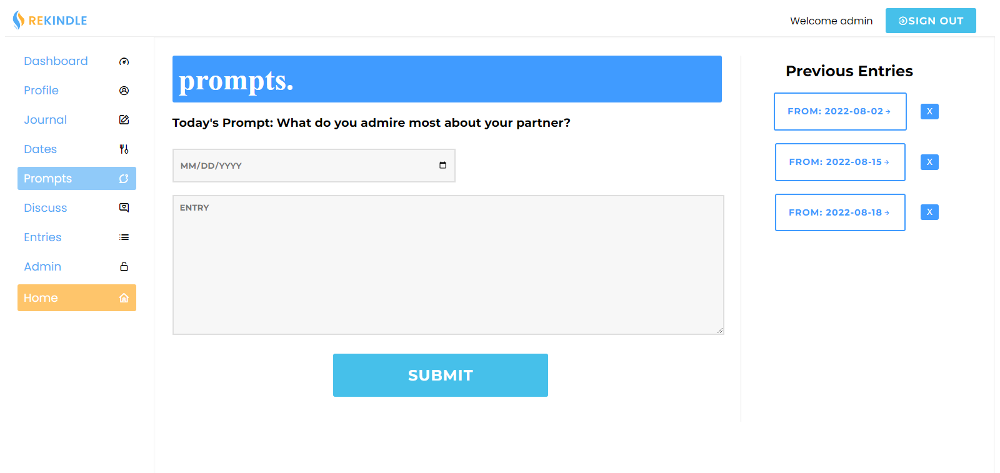
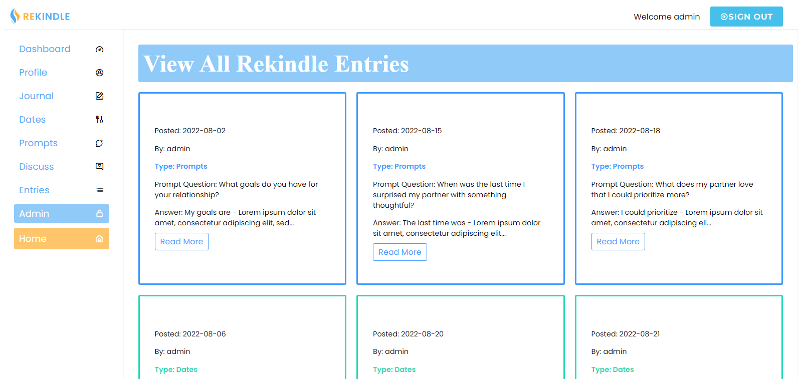
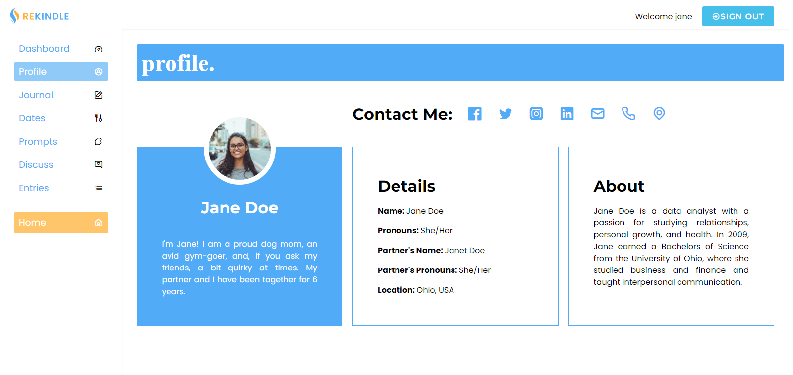

# ReKindle

## Table Of Contents

- <a href="#lang">Technologies</a>
- <a href="#about">About</a>
- <a href="#demo">Demo</a>
- <a href="#notes">Notes</a>
- <a href="#resources">Resources</a>
- <a href="#contact">Contact</a>

## Installation

### Server Side (Back end)
This is a Spring Rest Data JPA environment which will run at `localhost:8080`

### Client Side (Front end)

This is a single page JavaScript application built using React which will run at `localhost:3000`.

## How to run this app

- clone the application locally onto your machine
- Using IntelliJ, navigate into `application` and open the Spring project, run the application file.
- `cd` into `react-client`, open with VS Code and run `npm install` to install all frontend dependencies
- Run the front end with `npm start`

## Technologies

- Java
- Spring JPA
- Javascript
- Node JS
- React JS
- JSX / SCSS
- Rest API

<!-- About -->

## About

Rekindle is a relationship application aimed toward helping couples engage with their partners. It features a collection of tools, questions, and ideas designed to foster a deeper connection and meaningful conversation with your significant other.

(<a href="#top">BACK TO TOP</a>)

## Demo & Screenshots

### A live site for this project will be hosted shortly!

## Notes

Rekindle is a self-help tool aimed toward helping couples reconnect and engage with their partner in order to strengthen their relationship through introspection, communication, discovery, and fun.

(<a href="#top">BACK TO TOP</a>)

## Resources Used

- Canva
- Story Set
- Flaticon

## Contact & Contributors

### LinkedIn:

 <a href="https://www.linkedin.com/in/zayletfeliciano/">Zaylet Feliciano</a>
 <a href="https://www.linkedin.com/in/11gailanne/">Gail Cowley</a>
 <a href="https://www.linkedin.com/in/chad-zimmerman-4b4b35220/">Chad Zimmerman</a>
 <a href="https://www.linkedin.com/in/joe-buckley-4358561a2/">Joe Buckley</a>
 <a href="https://www.linkedin.com/in/zibad/">Zibad Maldaye</a>
 <a href="https://www.linkedin.com/in/noellegisewhite/">Noelle Gisewhite</a>

(<a href="#top">BACK TO TOP</a>)

